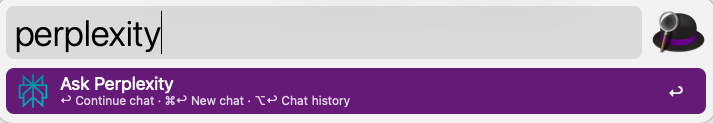

# Perplexity AI Alfred Workflow

An Alfred workflow for interacting with Perplexity AI, forked from the official [ChatGPT / DALL-E workflow](https://alfred.app/workflows/alfredapp/openai/) (version 2024.19), but using the [Perplexity](https://www.perplexity.ai/hub) API instead. So it supports web search.

## Installation

1. Download the latest version of the workflow from the [Releases](https://github.com/knyl2013/perplexity-workflow/releases) page.
2. Double-click the downloaded `Perplexity.alfredworflow` file to install it in Alfred.
3. Follow the setup instructions below to configure your API key.

## Setup

1. [Create an PerplexityAI account get an API key](https://docs.perplexity.ai/guides/getting-started#generate-an-api-key).
2. Copy your secret key and add it to the [Workflow’s Configuration](https://www.alfredapp.com/help/workflows/user-configuration/).

### Usage

Query Perplexity via the `perplexity` keyword, the [Universal Action](https://www.alfredapp.com/help/features/universal-actions/), or the [Fallback Search](https://www.alfredapp.com/help/features/default-results/fallback-searches/).

- <kbd>↩</kbd> Ask a new question.
- <kbd>⌘</kbd><kbd>↩</kbd> Clear and start new chat.
- <kbd>⌥</kbd><kbd>↩</kbd> Copy last answer.
- <kbd>⌃</kbd><kbd>↩</kbd> Copy full chat.
- <kbd>⇧</kbd><kbd>↩</kbd> Stop generating answer.
